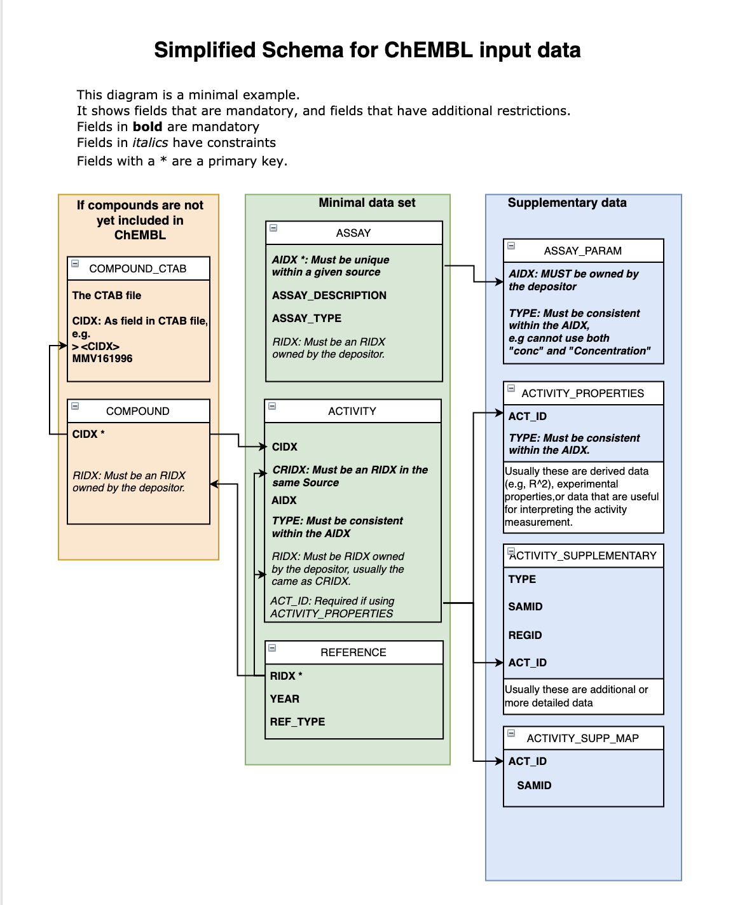

# Input File structure and requirements

This page describes all aspects of the requirements for loading BioActivity data, including the permitted file names and column headers, and the permitted content of the cells (or 'fields') within these files.

Files must be supplied as tab-separated text files with UTF-8 encoding (See [examples](https://app.gitbook.com/@chembl/s/chembl-loader/loader-model/example)). Spreadsheets will not work with the loader.

### Simplified input data schema&#x20;

### Rules

The 'rules' referred to are summarized in table form at the end of this page.&#x20;

* Rules are applied when validating the file.
* Each rule is associated with a single ‘Penalty Score’ (PS) value, which can range from 0 to 9 inclusive.
* The higher the score, the more serious the problem. Scores of 9 cause an automatic load failure.

## Files that may be included in a CHEMBL deposition

| Filenames                | Existence                                                                    | Level         | Depositor Defined ID (DDID) defined by this file | Definition of Primary Key | All records in this file must be 'Foreign-Keyed' to... |
| ------------------------ | ---------------------------------------------------------------------------- | ------------- | ------------------------------------------------ | ------------------------- | ------------------------------------------------------ |
| ASSAY.tsv                | Optional                                                                     | primary       | AIDX                                             | ('AIDX',)                 | -                                                      |
| ASSAY\_PARAM.tsv         | Optional                                                                     | secondary     | -                                                | -                         | AIDX in ASSAY                                          |
| COMPOUND\_RECORD.tsv     | Optional (But Mandatory if compound records do not exist for your compounds) | primary       | CIDX                                             | ('CIDX', 'RIDX')          | -                                                      |
| COMPOUND\_CTAB.sdf       | Optional                                                                     | secondary     | -                                                | -                         | CIDX in COMPOUND\_RECORD                               |
| REFERENCE.tsv            | Optional                                                                     | primary       | RIDX                                             | ('RIDX',)                 | -                                                      |
| ACTIVITY.tsv             | Optional                                                                     | tertiary      | -                                                | -                         | -                                                      |
| ACTIVITY\_PROPERTIES.tsv | Optional                                                                     | not defined   | -                                                | -                         | -                                                      |
| ACTIVITY\_SUPP.tsv       | Optional                                                                     | not defined   | -                                                | -                         | -                                                      |
| ACTIVITY\_SUPP\_MAP.tsv  | Optional                                                                     | not defined   | -                                                | -                         | -                                                      |
| _INFO.txt_               | _Irrelevant_                                                                 | _not defined_ | -                                                | -                         | -                                                      |

&#x20;**File:** All filenames must  have a 3 letter extension (eg: '.txt', '.tsv', '.sdf', etc).\
&#x20;****&#x20;

**Existence:**&#x20;

* _Irrelevant_ - May exist, but will be ignored if it does.&#x20;
* Optional - May exist, and will be used if it does.
* **Mandatory** - Must exist, and the dataset will not load if it does not.
*

Some fields will only take certain valid identifiers, for example ASSAY.TEST\_TYPE must be "in vitro", "in vivo", or "ex vivo". Valid datatypes are described in the tables and also summarised [here](untitled-10.md#summary-of-pattern-and-dependency-rules).

## **Field names and data types for the deposited files**

(Existence PS is just the internal error code for if this field is missing. External depositors may ignore this)

### ASSAY

| Header                       | Description                                                                                                                                                        | Existence     | Existence PS | DataType in database               | Datatype rule                       | Datatype rule PS | Pattern                                                                                                                                | Pattern PS | Depend                                                                                           | Depend PS |
| ---------------------------- | ------------------------------------------------------------------------------------------------------------------------------------------------------------------ | ------------- | ------------ | ---------------------------------- | ----------------------------------- | ---------------- | -------------------------------------------------------------------------------------------------------------------------------------- | ---------- | ------------------------------------------------------------------------------------------------ | --------- |
|                              |                                                                                                                                                                    |               |              |                                    |                                     |                  |                                                                                                                                        |            |                                                                                                  |           |
| **AIDX**                     | The AIDX cited by the depositor. A Primary Key defined header                                                                                                      | **Mandatory** | 9            | VARCHAR2(200 BYTE) NOT NULL ENABLE | Any character upto a length of 200  | 9                | Content                                                                                                                                | Content    | Content                                                                                          | Content   |
| RIDX                         | The RIDX cited by the depositor. A Self-Referencing field. MUST be owned by depositor \[ie: Not a PK Identifier, but a FK to an identifier owned by the depositor] | Optional      | 0            | VARCHAR2(200 BYTE)                 | Any character upto a length of 200  | 9                | Content                                                                                                                                | Content    | Content                                                                                          | Content   |
| **ASSAY\_DESCRIPTION**       | A description of the assay                                                                                                                                         | **Mandatory** | 9            | VARCHAR2(4000 BYTE)                | Any character upto a length of 4000 | 9                | Content                                                                                                                                | Content    | Content                                                                                          | Content   |
| **ASSAY\_TYPE**              | The type of the assay. B (Binding) ,F (Functional),A (ADMET),U (Unassigned),P (Physicochemical)  or T (toxicity)                                                   | **Mandatory** | 9            | VARCHAR2(1 BYTE)                   | Any character upto a length of 1    | 9                | 
Accepted Assay types 

(ADMET, A, Functional, F, Binding, B, Unassigned, U, Physiochemical, P, Toxicity, T)

[gp019 ]
 | 5          | gd2 A short desc of gd2 targ fld:ASSAY\_TAX\_ID                                                  | 0         |
| ASSAY\_TEST\_TYPE            | The type of assay test. in vitro, in vivo or ex vivo                                                                                                               | Optional      | 0            | VARCHAR2(20 BYTE)                  | Any character upto a length of 20   | 9                | 
Accepted Assay test types 

(in vitro, in vivo, ex vivo) 
                                                                  | 0          | Content                                                                                          | Content   |
| ASSAY\_ORGANISM              | The assay organism                                                                                                                                                 | Optional      | 0            | VARCHAR2(250 BYTE)                 | Any character upto a length of 250  | 9                | Content                                                                                                                                | Content    | Content                                                                                          | Content   |
| ASSAY\_STRAIN                | The strain of the assay organism                                                                                                                                   | Optional      | 0            | VARCHAR2(200 BYTE)                 | Any character upto a length of 200  | 9                | Content                                                                                                                                | Content    | Content                                                                                          | Content   |
| ASSAY\_TAX\_ID               | NCBI taxonomy ID for the assay organism                                                                                                                            | Optional      | 0            | NUMBER(11,0)                       | Any integer upto a length of 11     | 9                | 
Positive integer or '0' (regex='^\d*$')

[gp003]
                                                                           | 9          | gd3 If populated with an integer, then some text expected in this field targ fld:ASSAY\_ORGANISM | 0         |
| ASSAY\_SOURCE                | The original source of the assay                                                                                                                                   | Optional      | 0            | VARCHAR2(100 BYTE)                 | Any character upto a length of 100  | 9                | Content                                                                                                                                | Content    | Content                                                                                          | Content   |
| ASSAY\_TISSUE                | The type of tissue used in the assay                                                                                                                               | Optional      | 0            | VARCHAR2(100 BYTE)                 | Any character upto a length of 100  | 9                | Content                                                                                                                                | Content    | Content                                                                                          | Content   |
| ASSAY\_CELL\_TYPE            | The cell line                                                                                                                                                      | Optional      | 0            | VARCHAR2(100 BYTE)                 | Any character upto a length of 100  | 9                | Content                                                                                                                                | Content    | Content                                                                                          | Content   |
| ASSAY\_SUBCELLULAR\_FRACTION | The subcellular fraction used in the assay                                                                                                                         | Optional      | 0            | VARCHAR2(100 BYTE)                 | Any character upto a length of 100  | 9                | Content                                                                                                                                | Content    | Content                                                                                          | Content   |
| TARGET\_TYPE                 | The type of target                                                                                                                                                 | Optional      | 0            | VARCHAR2(25 BYTE)                  | Any character upto a length of 25   | 9                | [Target type list](untitled-10.md#summary-of-pattern-and-dependency-rules)                                                             | 5          | gd1 Type of target restricts kind of accession used. targ fld:TARGET\_ACCESSION                  | 7         |
| TARGET\_NAME                 | The name of the target                                                                                                                                             | Optional      | 0            | VARCHAR2(400 BYTE)                 | Any character upto a length of 400  | 9                | Content                                                                                                                                | Content    | Content                                                                                          | Content   |
| TARGET\_ACCESSION            | The accession number of the target (eg: UniProt Acc, NCBI tax ID)                                                                                                  | Optional      | 0            | VARCHAR2(255 BYTE)                 | Any character upto a length of 255  | 9                | 
An integer or a UniProt ID

[gp024]
                                                                                        | 2          | Content                                                                                          | Content   |
| TARGET\_ORGANISM             | The target organism                                                                                                                                                | Optional      | 0            | VARCHAR2(100 BYTE)                 | Any character upto a length of 100  | 9                | Content                                                                                                                                | Content    | Content                                                                                          | Content   |
| TARGET\_TAX\_ID              | The NCBI taxonomy ID of the target organism                                                                                                                        | Optional      | 0            | NUMBER(11,0)                       | Any integer upto a length of 11     | 9                | 
Positive integer or '0' (regex='^\d*$')

[gp003]
                                                                           | 9          | Content                                                                                          | Content   |

### ASSAY\_PARAM

| Header      | Description                                                                                                                                                        | Existence     | Existence PS | DataType in database               | Datatype rule                                      | Datatype rule PS | Pattern                                                                                       | Pattern PS | Depend  | Depend PS |
| ----------- | ------------------------------------------------------------------------------------------------------------------------------------------------------------------ | ------------- | ------------ | ---------------------------------- | -------------------------------------------------- | ---------------- | --------------------------------------------------------------------------------------------- | ---------- | ------- | --------- |
| **AIDX**    | The AIDX cited by the depositor. A Self-Referencing field. MUST be owned by depositor \[ie: Not a PK Identifier, but a FK to an identifier owned by the depositor] | **Mandatory** | 9            | VARCHAR2(200 BYTE) NOT NULL ENABLE | Any character upto a length of 200                 | 9                | Content                                                                                       | Content    | Content | Content   |
| **TYPE**    | The type of parameter. Must be unique within an AIDX                                                                                                               | **Mandatory** | 9            | VARCHAR2(250 BYTE)                 | Any character upto a length of 250                 | 9                | Content                                                                                       | Content    | Content | Content   |
| RELATION    | Symbol indicating relationship between the Type and the Value (permitted: '>','<','=','\~','<=','>=','<<','>>')                                                    | Optional      | 0            | VARCHAR2(50 BYTE)                  | Any character upto a length of 50                  | 9                | 
Relation symbol 

(=, >, &#x3C;, ~, &#x3C;=, >=, >>, &#x3C;&#x3C;)

[gp022 ]
 | 2          | Content | Content   |
| VALUE       | The numerical value of the parameter.                                                                                                                              | Optional      | 0            | NUMBER                             | Any number (incl decimals, negatives and sci Notn) | 9                | 
Any Number. Decimal, Sci Notn, +/-

[gp005 }
                                      | 9          | Content | Content   |
| UNITS       | The units of the parameter measurement                                                                                                                             | Optional      | 0            | VARCHAR2(100 BYTE)                 | Any character upto a length of 100                 | 9                | Content                                                                                       | Content    | Content | Content   |
| TEXT\_VALUE | The text value of non-numerical values                                                                                                                             | Optional      | 0            | VARCHAR2(4000 BYTE)                | Any character upto a length of 4000                | 9                | Content                                                                                       | Content    | Content | Content   |
| COMMENTS    | A comment on the parameter.                                                                                                                                        | Optional      | 0            | VARCHAR2(4000 BYTE)                | Any character upto a length of 4000                | 9                | Content                                                                                       | Content    | Content | Content   |

### COMPOUND\_RECORD

| Header           | Description                                                                                                                                                        | Existence     | Existence PS | DataType in database               | Datatype rule                       | Datatype rule PS | Pattern | Pattern PS | Depend  | Depend PS |
| ---------------- | ------------------------------------------------------------------------------------------------------------------------------------------------------------------ | ------------- | ------------ | ---------------------------------- | ----------------------------------- | ---------------- | ------- | ---------- | ------- | --------- |
| **CIDX**         | The CIDX cited by the depositor. A Primary Key defined header                                                                                                      | **Mandatory** | 9            | VARCHAR2(200 BYTE) NOT NULL ENABLE | Any character upto a length of 200  | 9                | Content | Content    | Content | Content   |
| RIDX             | The RIDX cited by the depositor. A Self-Referencing field. MUST be owned by depositor \[ie: Not a PK Identifier, but a FK to an identifier owned by the depositor] | Optional      | 0            | VARCHAR2(200 BYTE)                 | Any character upto a length of 200  | 9                | Content | Content    | Content | Content   |
| COMPOUND\_KEY    | The local synonym used for this CIDX in the RIDX quoted                                                                                                            | Optional      | 0            | VARCHAR2(250 BYTE)                 | Any character upto a length of 250  | 9                | Content | Content    | Content | Content   |
| COMPOUND\_NAME   | The name used for this CIDX in the RIDX quoted                                                                                                                     | Optional      | 0            | VARCHAR2(4000 BYTE)                | Any character upto a length of 4000 | 9                | Content | Content    | Content | Content   |
| COMPOUND\_SOURCE | The source of this CIDX in the RIDX quoted                                                                                                                         | Optional      | 0            | VARCHAR2(400 BYTE)                 | Any character upto a length of 400  | 9                | Content | Content    | Content | Content   |

### COMPOUND\_CTAB

| Header   | Description                                                                                                  | Existence     | Existence PS | DataType in database               | Datatype rule                      | Datatype rule PS | Pattern | Pattern PS | Depend  | Depend PS |
| -------- | ------------------------------------------------------------------------------------------------------------ | ------------- | ------------ | ---------------------------------- | ---------------------------------- | ---------------- | ------- | ---------- | ------- | --------- |
| **CIDX** | The CIDX cited by the depositor \[but, note that an alternative header label can be set using the -C option] | **Mandatory** | 9            | VARCHAR2(200 BYTE) NOT NULL ENABLE | Any character upto a length of 200 | 9                | Content | Content    | Content | Content   |
| CTAB     | The CTAB (Connection table) assigned to this CIDX                                                            | Optional      | 0            | CLOB                               | A very large text field            | 9                | Content | Content    | Content | Content   |

### REFERENCE 

| Header        | Description                                                   | Existence     | Existence PS | DataType in database               | Datatype rule                                                       | Datatype rule PS | Pattern                                                                                               | Pattern PS | Depend  | Depend PS |
| ------------- | ------------------------------------------------------------- | ------------- | ------------ | ---------------------------------- | ------------------------------------------------------------------- | ---------------- | ----------------------------------------------------------------------------------------------------- | ---------- | ------- | --------- |
| **RIDX**      | The RIDX cited by the depositor. A Primary Key defined header | **Mandatory** | 9            | VARCHAR2(200 BYTE) NOT NULL ENABLE | Any character upto a length of 200. Will warn if this starts with 0 | 9                | Content                                                                                               | Content    | Content | Content   |
| PUBMED\_ID    | PubMed ID                                                     | Optional      | 0            | NUMBER(11,0)                       | Any integer upto a length of 11                                     | 9                | 
Positive integer (regex='^[1-9]\d*$')

[gp006]
                                            | 1          | Content | Content   |
| JOURNAL\_NAME | Journal name                                                  | Optional      | 0            | VARCHAR2(50 BYTE)                  | Any character upto a length of 50                                   | 9                | Content                                                                                               | Content    | Content | Content   |
| **YEAR**      | Year of publication                                           | **Mandatory** | 0            | NUMBER(4,0)                        | Any integer upto a length of 4                                      | 9                | 
1900 > year > 2050

[gp031]
                                                               | 9          | Content | Content   |
| VOLUME        | The volume of the publication                                 | Optional      | 0            | VARCHAR2(50 BYTE)                  | Any character upto a length of 50                                   | 9                | Content                                                                                               | Content    | Content | Content   |
| ISSUE         | The issue of the publication                                  | Optional      | 0            | VARCHAR2(50 BYTE)                  | Any character upto a length of 50                                   | 9                | Content                                                                                               | Content    | Content | Content   |
| FIRST\_PAGE   | The first page of the article                                 | Optional      | 0            | VARCHAR2(50 BYTE)                  | Any character upto a length of 50                                   | 9                | 
Positive integer (regex='^[1-9]\d*$')

[gp006]
                                            | 4          | Content | Content   |
| LAST\_PAGE    | The last page of the article                                  | Optional      | 0            | VARCHAR2(50 BYTE)                  | Any character upto a length of 50                                   | 9                | 
Positive integer (regex='^[1-9]\d*$')

[gp006]
                                            | 3          | Content | Content   |
| **REF\_TYPE** | The type of reference (Publication, Patent, Dataset, Book)    | **Mandatory** | 9            | VARCHAR2(50 BYTE)                  | Any character upto a length of 50                                   | 9                | 
An accepted reference type [case ins]

(Patent, Publication, Dataset, Book)

[gp032]
 | 2          | Content | Content   |
| TITLE         | The title of the reference                                    | Optional      | 0            | VARCHAR2(500 BYTE)                 | Any character upto a length of 500                                  | 9                | Content                                                                                               | Content    | Content | Content   |
| DOI           | The Digital Object Identifier                                 | Optional      | 0            | VARCHAR2(200 BYTE)                 | Any character upto a length of 200                                  | 9                | 
A Digital Object Identifier (regex='^(10\.\d\d\d\d+\/.*)$')

[gp010]
                      | 5          | Content | Content   |
| PATENT\_ID    | The Patent Identifier                                         | Optional      | 0            | VARCHAR2(200 BYTE)                 | Any character upto a length of 200                                  | 9                | 
A Patent Identifier (regex='^(WO|EP|US)\-?\d+.*$')

[gp011]
                               | 5          | Content | Content   |
| ABSTRACT      | The abstract of the article                                   | Optional      | 0            | CLOB                               | A very large text field                                             | 9                | Content                                                                                               | Content    | Content | Content   |
| AUTHORS       | A list of the authors of the publication                      | Optional      | 0            | VARCHAR2(4000 BYTE)                | Any character upto a length of 4000                                 | 9                | Content                                                                                               | Content    | Content | Content   |

### ACTIVITY 

| Header            | Description                                                                                                                                                        | Existence     | Existence PS | DataType in database               | Datatype rule                                      | Datatype rule PS | Pattern                                                                                       | Pattern PS | Depend  | Depend PS |
| ----------------- | ------------------------------------------------------------------------------------------------------------------------------------------------------------------ | ------------- | ------------ | ---------------------------------- | -------------------------------------------------- | ---------------- | --------------------------------------------------------------------------------------------- | ---------- | ------- | --------- |
| **CIDX**          | The CIDX cited by the depositor                                                                                                                                    | **Mandatory** | 9            | VARCHAR2(200 BYTE) NOT NULL ENABLE | Any character upto a length of 200                 | 9                | Content                                                                                       | Content    | Content | Content   |
| **CRIDX**         | The RIDX to be associated with the CIDX in the creation of the compound record. Must belong to SRC\_ID\_CIDX.                                                      | **Mandatory** | 0            | VARCHAR2(200 BYTE)                 | Any character upto a length of 200                 | 9                | Content                                                                                       | Content    | Content | Content   |
| SRC\_ID\_CIDX     | The SRC\_ID for the CIDX. If not specified, then value is assumed to be the SRC\_ID for the depositor                                                              | Optional      | 0            | NUMBER(4,0)                        | Any integer upto a length of 4                     | 9                | 
Positive integer (regex='^[1-9]\d*$')

[gp006]
                                    | 9          | Content | Content   |
| **AIDX**          | The AIDX cited by the depositor                                                                                                                                    | **Mandatory** | 9            | VARCHAR2(200 BYTE) NOT NULL ENABLE | Any character upto a length of 200                 | 9                | Content                                                                                       | Content    | Content | Content   |
| SRC\_ID\_AIDX     | The SRC\_ID for the AIDX. If not specified, then value is assumed to be the SRC\_ID for the depositor                                                              | Optional      | 0            | NUMBER(4,0)                        | Any integer upto a length of 4                     | 9                | 
Positive integer (regex='^[1-9]\d*$')

[gp006]
                                    | 9          | Content | Content   |
| RIDX              | The RIDX cited by the depositor. A Self-Referencing field. MUST be owned by depositor \[ie: Not a PK Identifier, but a FK to an identifier owned by the depositor] | Optional      | 0            | VARCHAR2(200 BYTE)                 | Any character upto a length of 200                 | 9                | Content                                                                                       | Content    | Content | Content   |
| TEXT\_VALUE       | The text value of non-numerical values                                                                                                                             | Optional      | 0            | VARCHAR2(1000 BYTE)                | Any character upto a length of 1000                | 9                | Content                                                                                       | Content    | Content | Content   |
| RELATION          | Symbol indicating relationship between the Type and the Value (permitted: '>','<','=','\~','<=','>=','<<','>>')                                                    | Optional      | 0            | VARCHAR2(50 BYTE)                  | Any character upto a length of 50                  | 9                | 
Relation symbol 

(=, >, &#x3C;, ~, &#x3C;=, >=, >>, &#x3C;&#x3C;)

[gp022 ]
 | 2          | Content | Content   |
| VALUE             | The numerical value of the activity measurement (see ACTIVITY\_COMMENT for non-numerical values)                                                                   | Optional      | 0            | NUMBER                             | Any number (incl decimals, negatives and sci Notn) | 9                | Any Number. Decimal, Sci Notn, +/-                                                            | 9          | Content | Content   |
| UPPER\_VALUE      | Where the activity is a range, this represents the highest value of the range (numerically), while the PUBLISHED\_VALUE column represents the lower value          | Optional      | 0            | NUMBER                             | Any number (incl decimals, negatives and sci Notn) | 9                | Content                                                                                       | Content    | Content | Content   |
| UNITS             | The units of the measurement                                                                                                                                       | Optional      | 0            | VARCHAR2(100 BYTE)                 | Any character upto a length of 100                 | 9                | Content                                                                                       | Content    | Content | Content   |
| SD\_MINUS         | Standard Deviation Lower limit                                                                                                                                     | Optional      | 0            | NUMBER                             | Any number (incl decimals, negatives and sci Notn) | 9                | Content                                                                                       | Content    | Content | Content   |
| SD\_PLUS          | Standard Deviation Upper limit                                                                                                                                     | Optional      | 0            | NUMBER                             | Any number (incl decimals, negatives and sci Notn) | 9                | Content                                                                                       | Content    | Content | Content   |
| ACTIVITY\_COMMENT | A comment on the activity measurement. Non-numerical 'values' should be given here. Equivalent to 'TEXT\_VALUE' field in many other tables.                        | Optional      | 0            | VARCHAR2(4000 BYTE)                | Any character upto a length of 4000                | 9                | Content                                                                                       | Content    | Content | Content   |
| CRIDX\_CHEMBLID   | The CHEMBLID for the CRIDX. Must belong to the SRC\_ID\_CIDX                                                                                                       | Optional      | 0            | VARCHAR2(200 BYTE)                 | Any character upto a length of 200                 | 9                | 
CHEMBLID format (regex='^CHEMBL\d+$')

[gp023]
                                    | 0          | Content | Content   |
| CRIDX\_DOCID      | The DOCID for the CRIDX. Must belong to the SRC\_ID\_CIDX                                                                                                          | Optional      | 0            | VARCHAR2(200 BYTE)                 | Any character upto a length of 200                 | 9                | Content                                                                                       | Content    | Content | Content   |
| ACT\_ID           | A local ID used to relate records in ACTIVITY\_PROPERTIES and Supplementary tables. Not required unless depositing such data.                                      | Optional      | 0            | NUMBER(11,0)                       | Any integer upto a length of 11                    | 9                | Content                                                                                       | Content    | Content | Content   |
| TEOID             | TEst Occasion ID, grouping together related Activity records. Depositor defined.                                                                                   | Optional      | 0            | NUMBER(11,0)                       | Any integer upto a length of 11                    | 9                | Content                                                                                       | Content    | Content | Content   |
| **TYPE**          | The type of measurement                                                                                                                                            | **Mandatory** | 9            | VARCHAR2(250 BYTE)                 | Any character upto a length of 250                 | 9                | Content                                                                                       | Content    | Content | Content   |

### ACTIVITY\_PROPERTIES

| Header       | Description                                                                                                                                                  | Existence     | Existence PS | DataType in database | Datatype rule                                      | Datatype rule PS | Pattern                                                                                       | Pattern PS | Depend  | Depend PS |
| ------------ | ------------------------------------------------------------------------------------------------------------------------------------------------------------ | ------------- | ------------ | -------------------- | -------------------------------------------------- | ---------------- | --------------------------------------------------------------------------------------------- | ---------- | ------- | --------- |
| **ACT\_ID**  | FK to the ACTIVITY file. Depositor defined.                                                                                                                  | **Mandatory** | 9            | NUMBER(11,0)         | Any integer upto a length of 11                    | 9                | Content                                                                                       | Content    | Content | Content   |
| **TYPE**     | The type of property measurement. Must be unique within an ACT\_ID                                                                                           | **Mandatory** | 9            | VARCHAR2(250 BYTE)   | Any character upto a length of 250                 | 9                | Content                                                                                       | Content    | Content | Content   |
| RELATION     | Symbol indicating relationship between the Type and the Value (permitted: '>','<','=','\~','<=','>=','<<','>>')                                              | Optional      | 0            | VARCHAR2(50 BYTE)    | Any character upto a length of 50                  | 9                | 
Relation symbol 

(=, >, &#x3C;, ~, &#x3C;=, >=, >>, &#x3C;&#x3C;)

[gp022 ]
 | 2          | Content | Content   |
| VALUE        | The numerical value of the property measurment                                                                                                               | Optional      | 0            | NUMBER               | Any number (incl decimals, negatives and sci Notn) | 9                | 
Any Number. Decimal, Sci Notn, +/-

[gp005]
                                       | 9          | Content | Content   |
| UNITS        | The units of the property measurement                                                                                                                        | Optional      | 0            | VARCHAR2(100 BYTE)   | Any character upto a length of 100                 | 9                | Content                                                                                       | Content    | Content | Content   |
| TEXT\_VALUE  | The text value of non-numerical values                                                                                                                       | Optional      | 0            | VARCHAR2(1000 BYTE)  | Any character upto a length of 1000                | 9                | Content                                                                                       | Content    | Content | Content   |
| COMMENTS     | A comment on the property                                                                                                                                    | Optional      | 0            | VARCHAR2(4000 BYTE)  | Any character upto a length of 4000                | 9                | Content                                                                                       | Content    | Content | Content   |
| RESULT\_FLAG | A flag to indicate, if set to 1, that this type is a dependent variable/result (e.g., slope) rather than an independent variable/parameter (0, the default). | Optional      | 0            | NUMBER(1,0)          | Any integer upto a length of 1                     | 9                | 
0 or 1 (regex='^(0|1)*$')

[gp001]
                                                | 9          | Content | Content   |

### ACTIVITY\_SUPPLEMENTARY

| Header      | Description                                                                                                       | Existence     | Existence PS | DataType in database | Datatype rule                                      | Datatype rule PS | Pattern                                                                                       | Pattern PS | Depend  | Depend PS |
| ----------- | ----------------------------------------------------------------------------------------------------------------- | ------------- | ------------ | -------------------- | -------------------------------------------------- | ---------------- | --------------------------------------------------------------------------------------------- | ---------- | ------- | --------- |
| **TYPE**    | The type of supplementary measurement                                                                             | **Mandatory** | 9            | VARCHAR2(250 BYTE)   | Any character upto a length of 250                 | 9                | Content                                                                                       | Content    | Content | Content   |
| RELATION    | Symbol indicating relationship between the Type and the Value (permitted: '>','<','=','\~','<=','>=','<<','>>')   | Optional      | 0            | VARCHAR2(50 BYTE)    | Any character upto a length of 50                  | 9                | 
Relation symbol 

(=, >, &#x3C;, ~, &#x3C;=, >=, >>, &#x3C;&#x3C;)

[gp022 ]
 | 2          | Content | Content   |
| VALUE       | The numerical value of the supplementary measurment                                                               | Optional      | 0            | NUMBER               | Any number (incl decimals, negatives and sci Notn) | 9                | 
Any Number. Decimal, Sci Notn, +/-

[gp005]
                                       | 9          | Content | Content   |
| UNITS       | The units of the supplementary measurement                                                                        | Optional      | 0            | VARCHAR2(100 BYTE)   | Any character upto a length of 100                 | 9                | Content                                                                                       | Content    | Content | Content   |
| TEXT\_VALUE | The text value of non-numerical values                                                                            | Optional      | 0            | VARCHAR2(1000 BYTE)  | Any character upto a length of 1000                | 9                | Content                                                                                       | Content    | Content | Content   |
| COMMENTS    | A comment on the record.                                                                                          | Optional      | 0            | VARCHAR2(4000 BYTE)  | Any character upto a length of 4000                | 9                | Content                                                                                       | Content    | Content | Content   |
| **REGID**   | Record Grouping Identifier. Groups together records in ACTIVITY\_SUPP file. Depositor defined. Analagous to TOID. | **Mandatory** | 9            | NUMBER(11,0)         | Any integer upto a length of 11                    | 9                | Content                                                                                       | Content    | Content | Content   |
| **ACT\_ID** | FK to the ACTIVITY file. Depositor defined.                                                                       | **Mandatory** | 9            | NUMBER(11,0)         | Any integer upto a length of 11                    | 9                | Content                                                                                       | Content    | Content | Content   |
| **SAMID**   | FK to the FK SAMID in ACTIVITY\_SUPP file. Depositor defined.                                                     | **Mandatory** | 9            | NUMBER(11,0)         | Any integer upto a length of 11                    | 9                | Content                                                                                       | Content    | Content | Content   |

## Summary of Pattern and Dependency Rules

&#x20;Regexes are only shown for Pattern rules. Dependency rules involve a number of regexes, and so are not easily shown here.

| Rule Type  | Rule ID | Short Description                                                   | Regex                                                                                                                                                                                                                                                                                                                                                                                                                                                           | Long Description                                                                                                                                                                                                       |
| ---------- | ------- | ------------------------------------------------------------------- | --------------------------------------------------------------------------------------------------------------------------------------------------------------------------------------------------------------------------------------------------------------------------------------------------------------------------------------------------------------------------------------------------------------------------------------------------------------- | ---------------------------------------------------------------------------------------------------------------------------------------------------------------------------------------------------------------------- |
| DEPENDENCY | gd1     | Type of target restricts kind of accession used.                    |                                                                                                                                                                                                                                                                                                                                                                                                                                                                 | The type of target restricts the kind of accession that should be used. For example, if the target type is 'Protein', then a UniProt ID is expected.. Target Field='TARGET\_ACCESSION'                                 |
| DEPENDENCY | gd2     | A short desc of gd2                                                 |                                                                                                                                                                                                                                                                                                                                                                                                                                                                 | A longer desc of gd2 Target Field='ASSAY\_TAX\_ID'                                                                                                                                                                     |
| DEPENDENCY | gd3     | If populated with an integer, then some text expected in this field |                                                                                                                                                                                                                                                                                                                                                                                                                                                                 | If this sfield is populated with an integer, then the target field should contain some text. Thus if the ASSAY\_TAX\_ID is given, then a name should also be provided for the organism. Target Field='ASSAY\_ORGANISM' |
| PATTERN    | gp001   | 0 or 1                                                              | ^(0\|1)\*$                                                                                                                                                                                                                                                                                                                                                                                                                                                      | 0 or 1                                                                                                                                                                                                                 |
| PATTERN    | gp003   | Positive integer or '0'                                             | ^\d\*$                                                                                                                                                                                                                                                                                                                                                                                                                                                          | A positive integer or zero                                                                                                                                                                                             |
| PATTERN    | gp005   | Any Number. Decimal, Sci Notn, +/-                                  | ^\\-?(\d+(\\.\d+)?\|\\.\d+)(e\\-?\\+?\d\d?)?$                                                                                                                                                                                                                                                                                                                                                                                                                   | A number. May be a decimal and may be positive or negative, May be scientific notation. Case Ins                                                                                                                       |
| PATTERN    | gp006   | Positive integer                                                    | ^\[1-9]\d\*$                                                                                                                                                                                                                                                                                                                                                                                                                                                    | gp006 A positive integer. Not zero                                                                                                                                                                                     |
| PATTERN    | gp010   | A Digital Object Identifier                                         | ^(10\\.\d\d\d\d+\\/.\*)$                                                                                                                                                                                                                                                                                                                                                                                                                                        | A Digital Object Identifier                                                                                                                                                                                            |
| PATTERN    | gp011   | A Patent Identifier                                                 | ^(WO\|EP\|US)\\-?\d+.\*$                                                                                                                                                                                                                                                                                                                                                                                                                                        | A Patent Identifier. WO,EP,US                                                                                                                                                                                          |
| PATTERN    | gp018   | Accepted Assay test types \[case Ins]                               | ^(in vitro\|in vivo\|ex vivo)$                                                                                                                                                                                                                                                                                                                                                                                                                                  | Accepted Assay test types. Case insensitive match                                                                                                                                                                      |
| PATTERN    | gp019   | Accepted Assay types \[case Ins]                                    | ^(ADMET\|A\|Functional\|F\|Binding\|B\|Unassigned\|U\|Physiochemical\|P\|Toxicity\|T)$                                                                                                                                                                                                                                                                                                                                                                          | Accepted Assay types. Case insensitive match                                                                                                                                                                           |
| PATTERN    | gp021   | Accepted Target types \[case ins]                                   | ^(None\|NUCLEIC\\-ACID\|NUCLEIC ACID\|TISSUE\|PROTEIN\|ORGANISM\|CELL\\-LINE\|CELL\\\_LINE\| CELL LINE\|ADMET\|UNKNOWN\|UNCHECKED\|SUBCELLULAR\|NO TARGET\|PROTEIN COMPLEX\|PROTEIN FAMILY\|PROTEIN COMPLEX GROUP\|CHIMERIC PROTEIN\|SELECTIVITY GROUP\|PROTEIN\\-PROTEIN INTERACTION\|SINGLE PROTEIN\|MOLECULAR\|NON\\-MOLECULAR\|UNDEFINED\|PHENOTYPE\|PROTEIN NUCLEIC\\-ACID COMPLEX\|SMALL MOLECULE\|OLIGOSACCHARIDE\|METAL\|LIPID\|MACROMOLECULE\| Other)$ | Accepted Taregt types. Case insensitive match.                                                                                                                                                                         |
| PATTERN    | gp022   | relation symbol (=,>,etc).                                          | ^(\\=\|\\>\|\\<\|\\\~\|\\<\\=\|\\>\\=\|\\>\\>\|\\<\\<)\\=?$                                                                                                                                                                                                                                                                                                                                                                                                     | An accepted relation symbol                                                                                                                                                                                            |
| PATTERN    | gp023   | CHEMBLID format                                                     | ^CHEMBL\d+$                                                                                                                                                                                                                                                                                                                                                                                                                                                     | The accepted format for a CHEMBLID                                                                                                                                                                                     |
| PATTERN    | gp024   | An integer or a UniProt ID                                          | ^(\d+)\|(\[OPQ]\[0-9]\[A-Z0-9]{3}\[0-9]\|\[A-NR-Z]\[0-9]\(\[A-Z]\[A-Z0-9]{2}\[0-9]){1,2})                                                                                                                                                                                                                                                                                                                                                                       | An integer or a UniProt ID. Acceptable 'Accession IDs'                                                                                                                                                                 |
| PATTERN    | gp031   | 1900 > year > 2050                                                  | ^(19\d\d\|20(0\|1\|2\|3\|4)\d)$                                                                                                                                                                                                                                                                                                                                                                                                                                 | 1900 > year > 2050                                                                                                                                                                                                     |
| PATTERN    | gp032   | An accepted reference type \[case ins]                              | ^(Patent\|Publication\|Dataset\|Book)$                                                                                                                                                                                                                                                                                                                                                                                                                          | A accepted reference type. Case insensitive match                                                                                                                                                                      |
